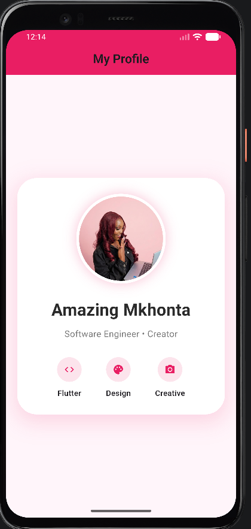

# Circle Avatar Demo

## Widget Description

This Flutter project demonstrates Flutter's CircleAvatar widget using a student profile screen.

CircleAvatar is commonly used to display user profile pictures in modern mobile applications.

---

## Real-World Use Case

This app represents a student profile interface where user information and profile identity are displayed.

---

## Run Instructions

1. Clone the repository
2. Open in Android Studio
3. Run:

flutter pub get

flutter run

---

## CircleAvatar Properties Demonstrated

### 1. radius

Controls the size of the profile image.

### 2. backgroundColor

Changes the avatar's background appearance.

### 3. backgroundImage

Displays the user's profile image.

---

## Final UI Screenshot

